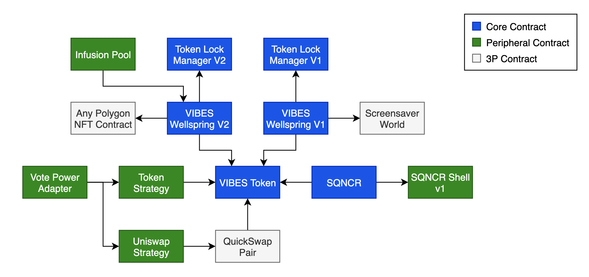

# ⚙️ Architecture

## Smart Contract Architecture

* **VIBES Token** - The ERC-20 token contract for **VIBES**
* **VIBES Wellspring V1** - The original VIBES Wellspring contract that handles the bookkeeping associated with provenance mining. Read data is proxied through the Wellspring V2 contract now, but the original infused VIBES are still locked in this contract.
* **VIBES Wellspring V2** - Wellspring V2 improves on V1 by adding support for multiple NFT contracts, better on-chain enumerability, and multi-artist support. Locked tokens cannot be removed except by NFT owners via provenance mining
* **Token Lock Manager** **V1** - Simple lock/unlock switch for a given token ID with a time-release for unlocking. "Locking" a token just sets a flag on this contract, which can be checked by other contracts before allowing actions \(such as claiming mined **VIBES**\)
* **Token Lock Manager V2** - Same as V1, except it supports multiple NFT contracts
* **SQNCR** - Core ERC-721 for SQNCR. Controls minting and metadata management
* **SQNCR Shell v1** - Current metadata resolver for the SQNCR NFTs.
* **Vote Power Adapter** - Exposes the VIBES vote power for a given address. Maintains a list of strategy contracts that are summed together
* **Strategy Contracts** - Individual vote power strategies such as checking token balance, checking claimable **VIBES**, and checking pooled **VIBES** on QuickSwap.


See the [Protocol Info page ](https://sickvibes.xyz/protocol)on the VIBES site for real-time metrics and info about the smart contract cluster.


## VIBES Contract Addresses

All contracts are open source and verified on Polygonscan:

| Contract | Address |
| :--- | :--- |
| VIBES Token | `0xd269af9008c674b3814b4830771453d6a30616eb` |
| VIBES Wellspring V1 | `0x37bD35C6967B786306b6Fa201Ec5Cf5751675804` |
| Token Lock Manager | `0x6Eb8E2770939F586F0B5A3C0143aB353E5Fff44c` |
| Token Strategy | `0x9940D367E0596f64DbcbBd57f480359E4A2F852f` |
| Uniswap Strategy | `0xD35BA61d9Bd9AFe04347D88e59A4328a65dC9F4B` |
| Vote Power Adapter | `0xA2f67C69B1F5cFa725839a110901761C718eeB59` |
| Vote Power Token Facade | `0xc6194299cdd7f0574ad8d63e23fd33c612efff98` |
| VIBES Wellspring V2 | `0x2b1f852e38324AAD4788B140df84525ba5e3BABE` |
| Token Lock Manager V2 | `0x222DA9397FCfcea9DB8e3423cd0d3b64bd16ac33` |
| SQNCR | `0x15BF3fF3D8a1d147372b9ec0A92878b11D31829E` |
| SQNCR Default Shell | `0x5fe2B6570Dd77692D0DA409D43Eff29c2c1414D0` |
| Infusion Pool | `0x5d8a3953f56c3a8ff7ab454541fd3bc7b7b0bd08` |


View the `contracts.ts` file in the VIBES site source code:

[https://github.com/sickvibes/vibes-site/blob/main/src/contracts.ts](https://github.com/sickvibes/vibes-site/blob/main/src/contracts.ts)


## Third-party Contracts

These contracts are used in the VIBES contract cluster but are from external protocols:

| Contract | Address |
| :--- | :--- |
| QuickSwap VIBES-MATIC Pair | `0x4F9e9C2EB7D90447FA190d4986b9E0A1562E2587` |
| Screensaver World \(NFT and auction\) | `0x486ca491C9A0a9ACE266AA100976bfefC57A0Dd4` |
| Screensaver World V0 | `0x2452d8049f04d54ca779257678a691ee4a413267` |
| VIBES Multisig Gnosis Safe | `0x41925458151134A5324c9382915fc94C31Bce1B3` |

