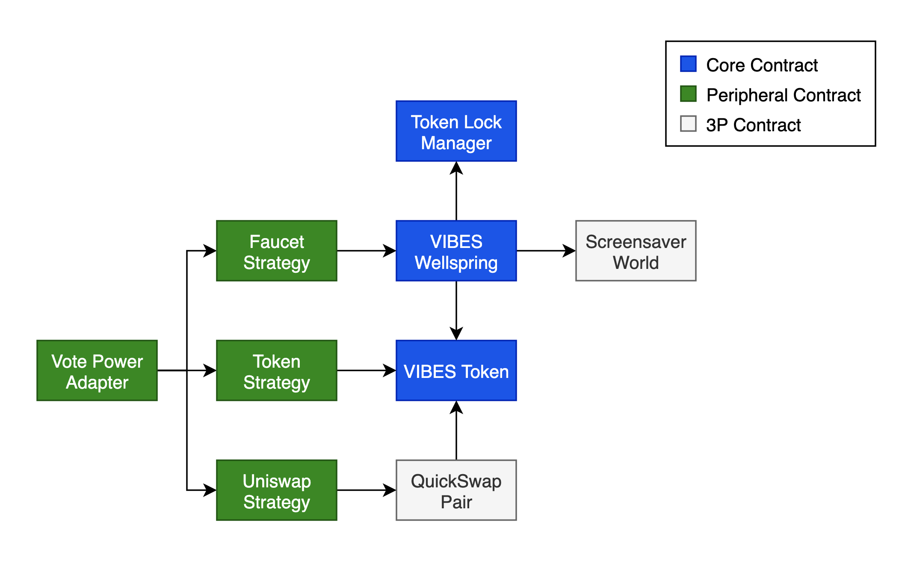

# ⚙️ Architecture

## Smart Contract Architecture

* **VIBES Token** - The ERC-20 token contract for **VIBES**
* **VIBES Wellspring** - Has the **VIBES** that can be [provenance mined](../vibes-protocol/provenance-mining.md) locked inside of it. Manages the bookeeping associated with claiming mined **VIBES**.
* **Token Lock Manager** - Simple lock/unlock switch for a given token ID with a time-release for unlocking. "Locking" a token just sets a flag on this contract, which can be checked by other contracts before allowing actions \(such as claiming mined **VIBES**\)
* **Vote Power Adapter** - Exposes the VIBES vote power for a given address. Maintains a list of strategy contracts that are summed together
* **Strategy Contracts** - Individual vote power strategies such as checking token balance, checking claimable **VIBES**, and checking pooled **VIBES** on QuickSwap.

## Contract Addresses

All contracts are open source and verified on Polygonscan:

| Contract | Address |
| :--- | :--- |
| VIBES ERC-20 Token | `0xd269af9008c674b3814b4830771453d6a30616eb` |
| VIBES Wellspring | `0x37bD35C6967B786306b6Fa201Ec5Cf5751675804` |
| Token Lock Manager | `0x6Eb8E2770939F586F0B5A3C0143aB353E5Fff44c` |
| ERC-20 Balance Gov Strategy | `0x9940D367E0596f64DbcbBd57f480359E4A2F852f` |
| Token Faucet Gov Strategy | `0x2308BE9DFD702aeF9Ee42c28b54188A75f4313c9` |
| AMM Pool Gov Strategy | `0xD35BA61d9Bd9AFe04347D88e59A4328a65dC9F4B` |
| Vote Power Adapter | `0xA2f67C69B1F5cFa725839a110901761C718eeB59` |
| Vote Power Token Facade | `0xc6194299cdd7f0574ad8d63e23fd33c612efff98` |

