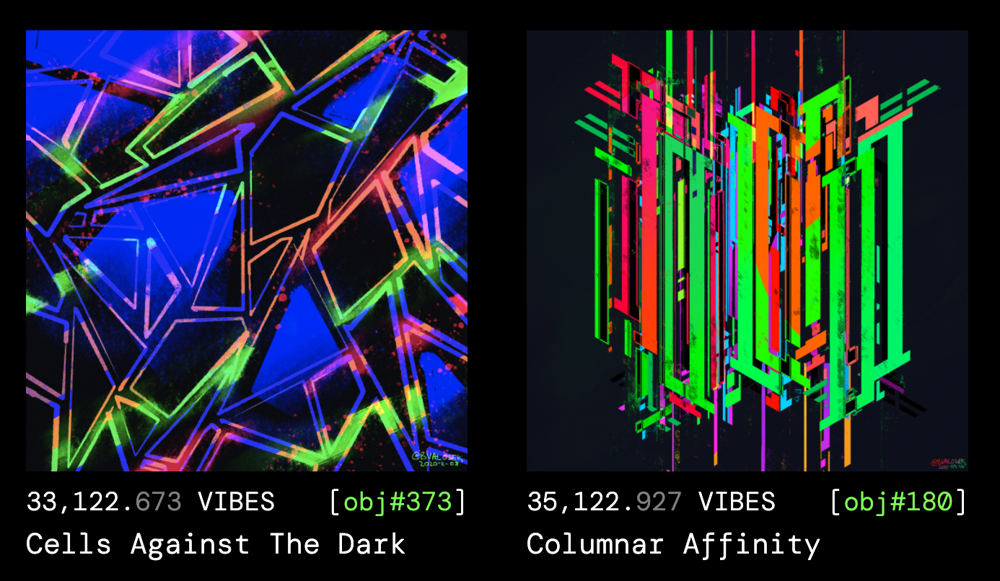

# 📹 Community Calls

## Community Call - 2021-07-01



Once upon a time, [Brandon](https://twitter.com/bvalosek) \(the dude talking for most of this video\) had launched his own [BVAL NFT project](https://tokens.bvalosek.com/) to learn about NFT smart contracts. He applied it at the intersection of his identity as a tech nerd and art butterfly. In doing so, a plethora of ideas to extend that base NFT smart contract standard to different utilities sprung forth in his mind. **Provenance mining** is one that took hold and is the basis of **VIBES**.

### Provenance Mining


**Provenance Mining** - Mining a token over time as an intrinsic part of holding an NFT, thereby representing the value of its historical existence


_A brief example of ~le provenance mining~_ 

Both these NFTs have not had any VIBES unstaked from them. You can see that the amount of VIBES being mined reflects their provenance \(the history/record of a thing\). \#180 was minted before \#373 and you can see that \#180 has minted more VIBES.

All NFTs are set to mine 1000 VIBES each day over 3 years which comes to about to $1M VIBES

### VIBES Utility

What can you do today with VIBES?

* [Go see all the NFTs](https://www.sickvibes.xyz/tokens) currently minting VIBES
* Bid and own NFTs minting VIBES on [Screensaver World](https://www.screensaver.world/created/0x303EeFeDeE1bA8e5d507a55465d946B2fea18583) \(currently just Brandon's work\)
* Trade NFTs containing VIBES
* Be a liquidity provider for VIBES on [Quickswap](https://quickswap.exchange/#/add/0xd269af9008c674b3814b4830771453d6a30616eb/ETH)

### Vibes on VIBES

VIBES is a project ran on L2 Polygon which means dirt-cheap gas fees! That's intentional in order to provide the VIBES community the ability to move and experiment at will.

* Experimenting with governance with different voting power distribution algorithms.
* Re-thinking value beyond "monetary value" e.g. having control over the network, making decisions about product and community direction
* Digital community sandbox
* Exploring and continuing to learn and expand DeFi, NFT, and governance concepts

Currently, there are around ~100 founding members of VIBES that received an initial airdrop of 10K VIBES.

#### A different way of bootstrapping liquidity

Many existing crypto projects that want to provide liquidity with their token will have an initial fundraising where a large amount of the tokens are distributed amongst liquidity providers that can provide mass liquidity to kickstart the project.

VIBES explores a more organic approach to bootstrapping liquidity via organically accruing it over time as a function of the NFT/art.

#### A permissionless and decentralized future

The future of VIBES is decentralization! This section is just a summary of what was discussed in the community call, but ultimately, the future of VIBES is dictated by the VIBES community.

Right now, permissions around the distribution and mechanisms of VIBES is centralized to Brandon \(who, admittedly, is a cool dude, but still\). In the near future, an intermediate step where a group of VIBES holders can collectively choose where to pool VIBES. And eventually after the community and VIBES mechanisms are ironed out and shaped up more, a permissionless and decentralized future where the community is self-sufficient and self-directed.

#### Enabling artists

The VIBES community can grow to have a very enriched internal and external art culture! Some features and ideas that came up during the community call are:

* Artists will be able to inject VIBES into their pieces!
* Using the [PartyDAO](https://party.mirror.xyz/) PartyBid system in the VIBES community for externally directed art voyages! As a collective, we can vote as a collective to support artists and add to a community-owned curated VIBES art collection.

### tl;dr

VIBES is an opportunity for learning and being creative at the intersection of NFTs, art, governance, DeFi, and building a crypto community. We can provide ourselves and others with an enriching community and culture where we're unafraid to explore, fail fast, and have tons of fun along the way. Who knows what the future will bring - but a foundation has been laid to re-think value, having a decentralized way of dictating the direction of community initiatives, and to create a bad-ass holographic unicorn vomiting rainbows type of art culture.

