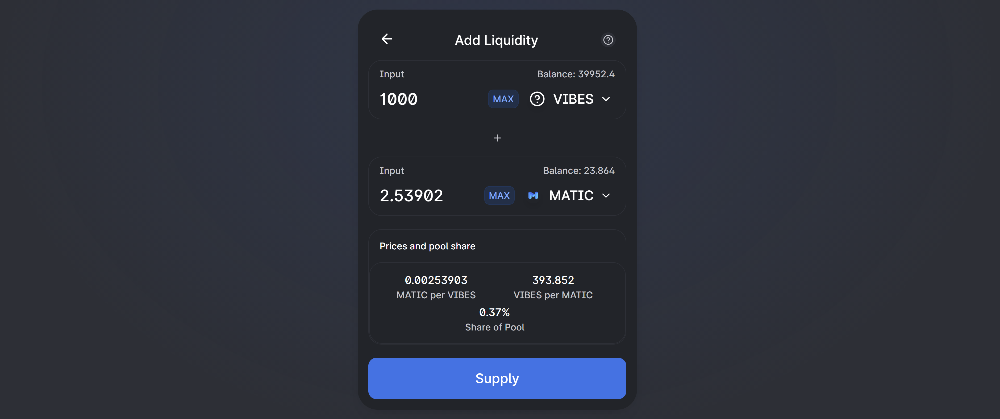

# ❓ The  Vibes Liquidity Pool

## What is a Liquidity Pool?

In a nutshell, the liquidity pool \(which we'll call "LP" \) determines the value and stability of a token. Say you have made a token called Apple, and you want it to be worth 0.1 Matic. You would then create an LP on a decentralized exchange \(a “DEX” is an exchange where tokens are swapped and valued\) that has, e.g., 1000 Apples and 100 Matic. The ratio of Apples to Matic is 10:1, and someone can then purchase ten Apples in the DEX for a single Matic.

However, when this purchase has been made, there are now 990 Apples and 101 Matic in the LP. So the price of Apples has gone up, and a single Matic will only get you 9.8 Apples. And so on. In this vastly simplified example. The LP keeps a pool of Apples and Matic to create a market for Apples. The DEX also charges a small fee for each transaction, and this fee is split up amongst the people that have Apples and Matic in the LP, according to the percentage of the pool they hold.

And finally, the size of the pool determines the stability of the token. The more Apples and Matic there are in the pool, the harder it is to move the price. In the example above, the price could be moved by 2% with a single small purchase. But if the pool was 10,000 Apples and 1,000 Matic, it would barely move at all. A large pool makes it much more difficult for a single person to sell all their Apples and crater the value of the token, and it adds a general sense of confidence to the token.

## Why Would I Want to add to the VIBES Liquidity Pool?

1. **It helps the VIBES ecosystem.** By providing liquidity, you help stabilize the intrinsic value of the token and become a true part of the community.
2. **Governance Farming!** VIBES holders get to propose and vote on the direction the ecosystem takes, and LP tokens give the holder far more voting power.
3. **You get a cut of the fees.** Every time a VIBES token is bought or sold on QuickSwap, you will receive a percentage of the fee for this exchange.

## What Are the Risks?

Being a part of the LP is not without risk. First and foremost, when someone buys or sells VIBES on the DEX, they're buying from or selling to you. So while the _ratio_ of your tokens will usually remain the same, according to when you added them, a large change in price can introduce impermanent loss. This is a complicated subject, too lengthy to cover here but know that it exists. In general, the larger the pool, the smaller the likelihood of impermanent loss, as the relative moves in the value of the tokens will be smaller.

In addition, your pool tokens will reflect the "true" values of both tokens. So if both VIBES and Matic go down in value, you have effectively multiplied your loss in Matic. The corollary, however, is that if both VIBES and Matic go _up_ in value, you multiply your gains. Providing LP can be quite lucrative, but it can also be quite painful. Know what you're getting in to.

## How Do I Add Liquidity?


If you do not have VIBES or Matic, you can not work with the Liquidity Pool. To learn how to get Matic and VIBES, and to work with the Polygon blockchain, we have written[ this handy guide.](how-to-connect-to-polygon-and-get-vibes-in-your-wallet.md)


If you own VIBES and MATIC, the VIBES liquidity pool is on the QuickSwap DEX. In your [VIBES wallet view](https://www.sickvibes.xyz/wallet) on SickVibes, hit the [POOL Liquidity](https://quickswap.exchange/#/add/0xd269af9008c674b3814b4830771453d6a30616eb/ETH) link, and this will take you to QuickSwap and set up the token pair.

In the screenshot above, we have added 1000 VIBES from our wallet. At the current value of VIBES, this will require 2.53 Matic. Down below, you can see that once we add this to the pool, our share of the pool will be 0.37%, which means we will receive 0.37% of every fee that QuickSwap charges when someone exchanges Matic and VIBES. After we hit "Supply" and have the usual signing dialog, we hit either the back arrow on the panel or the "Pools" link at the top of the page, and we are greeted with this, which shows everything we have in the pool:

If this is your first time supplying VIBES liquidity, you will need to add VIBES to the QuickSwap pool list manually to see it. \(Don't worry! It's there! QuickSwap doesn't show VIBES naturally.\) To do this, hit the "Don't see a pool you joined? Import it" link underneath the pools. Hit "Select A Token," then you will see this page:

Paste the contract address of VIBES in the field \(which is 0xd269af9008c674b3814b4830771453d6a30616eb \), finish the dialogue, and you should then see your VIBES pool.

Congratulations, you have now provided liquidity to VIBES! You can now add or remove liquidity from the pool via the Pools page. If you go back to your [VIBES wallet view](https://www.sickvibes.xyz/wallet) on SickVibes, you will see that your voting power has increased dramatically, and the Pooled Liquidity field reflects your pool tokens.

